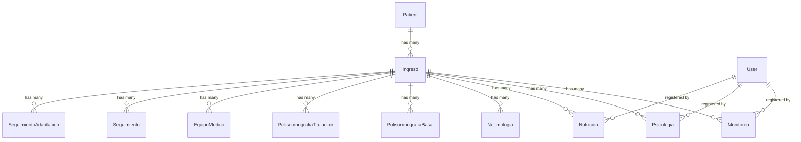

# Database Schema

DataMed uses a relational database (PostgreSQL in production, SQLite in development) with a carefully designed schema to manage patient data, clinical exams, and program cycles.

## Core Models Overview

DataMed's data model consists of three primary components:

1. **Patient Management**: Patient demographics and enrollment
2. **Program Cycles**: Ingreso model for 18-month capita cycles
3. **Clinical Exams**: Multiple exam types linked to cycles

## Entity Relationship Diagram



## Patient Model

The foundational model storing patient demographics and clinical baseline data.

### Fields

<ParamField path="nombre" type="CharField(100)" required>
  Patient's first name
</ParamField>

<ParamField path="apellido" type="CharField(100)" required>
  Patient's last name
</ParamField>

<ParamField path="tipo_documento" type="CharField(3)" required>
  Document type: RC, TI, CC, CE, PA, PE
</ParamField>

<ParamField path="documento" type="CharField(20)" required>
  Unique document number (primary identifier)
</ParamField>

<ParamField path="fecha_nacimiento" type="DateField" required>
  Date of birth
</ParamField>

<ParamField path="genero" type="CharField(10)" required>
  Gender: M (Masculino), F (Femenino), O (Otro)
</ParamField>

<ParamField path="departamento" type="CharField(100)" required>
  Colombian department (default: SANTANDER)
</ParamField>

<ParamField path="ciudad" type="CharField(100)" required>
  City from predefined list
</ParamField>

<ParamField path="zona" type="CharField(10)" required>
  URBANA or RURAL
</ParamField>

<ParamField path="telefono" type="CharField(20)" required>
  Home phone number
</ParamField>

<ParamField path="celular" type="CharField(20)" required>
  Mobile phone number
</ParamField>

<ParamField path="estado_civil" type="CharField(20)" required>
  Marital status: SOLTERO, CASADO, UNIÓN LIBRE, VIUDO, DIVORCIADO
</ParamField>

<ParamField path="entidad_salud" type="CharField(100)" required>
  Health insurance provider (EPS): ECOPETROL, SANITAS
</ParamField>

<ParamField path="estrato" type="IntegerField" required>
  Socioeconomic stratum (1-6)
</ParamField>

<ParamField path="peso" type="DecimalField(5,2)">
  Weight in kilograms
</ParamField>

<ParamField path="altura" type="DecimalField(4,2)">
  Height in meters
</ParamField>

<ParamField path="perimetro_abdominal" type="DecimalField(5,2)">
  Abdominal circumference in centimeters
</ParamField>

<ParamField path="cuello" type="DecimalField(5,2)">
  Neck circumference in centimeters
</ParamField>

<ParamField path="medico_remitente" type="CharField(100)" required>
  Referring physician name
</ParamField>

<ParamField path="especialidad" type="CharField(100)" required>
  Physician's specialty
</ParamField>

<ParamField path="diagnostico_clinico" type="TextField(1000)" required>
  Clinical diagnosis (currently limited to G47.3 - Sleep Apnea)
</ParamField>

<ParamField path="programa" type="CharField(100)" required>
  Program: PROGRAMA AOS or PROGRAMA INSOMNIO
</ParamField>

<ParamField path="valor_capita" type="DecimalField(10,2)" required>
  Capita value (default: 259783)
</ParamField>

### Computed Properties

```python apps/patients/models.py
@property
def ingreso_activo(self):
    return self.ingresos.filter(estado='ACTIVO').first()

@property
def esta_activo(self):
    return self.ingresos.filter(estado='ACTIVO').exists()

@property
def edad(self):
    today = date.today()
    age = today.year - self.fecha_nacimiento.year
    if (today.month, today.day) < (self.fecha_nacimiento.month, self.fecha_nacimiento.day):
        age -= 1
    return age
```

## Ingreso Model

Represents a patient's enrollment in an 18-month program cycle. Critical for data organization.

### Fields

<ParamField path="paciente" type="ForeignKey(Patient)" required>
  Related patient (CASCADE delete)
</ParamField>

<ParamField path="fecha_inicio" type="DateField" required>
  Program start date
</ParamField>

<ParamField path="fecha_fin" type="DateField">
  Program end date (null until terminated)
</ParamField>

<ParamField path="estado" type="CharField(20)" required>
  Status: ACTIVO, SUSPENDIDO, TERMINADO (default: ACTIVO)
</ParamField>

<ParamField path="motivo" type="TextField">
  Reason for status change or termination
</ParamField>

### Computed Property: mes_capita

Automatically calculates current program month (1-18):

```python apps/patients/models.py
@property
def mes_capita(self):
    if not self.fecha_inicio:
        return 0
    
    hoy = date.today()
    meses = (hoy.year - self.fecha_inicio.year) * 12 + (hoy.month - self.fecha_inicio.month) + 1
    
    if meses < 1: return 1
    if meses > 18: return 18
    return meses
```

### Design Pattern: Data Isolation

All clinical exams are linked to an `Ingreso`, not directly to `Patient`. This ensures:
- Historical data preservation when cycles close
- Clean separation between program cycles
- Accurate capita month tracking

## Clinical Exam Models

### Monitoreo (CPAP/BiPAP Monitoring)

Tracks device usage and treatment effectiveness.

**Key Fields**:
- `uso_diario`: Daily usage percentage
- `dias_uso_horas_4`: Days with ≥4 hours usage
- `hipopnea_basal`: Baseline AHI (copied from PSG Basal)
- `hipopnea_residual`: Residual AHI with treatment
- `porcentaje_correccion`: Auto-calculated `((basal - residual) / basal) * 100`
- `modo_ventilatorio`: CPAP, BPAP, BPAP ST
- `presion_ipap`, `presion_epap`: Pressure settings
- `mascara_cpap`, `tamano_mascara`: Mask type and size

### PolisomnografiaBasal (Diagnostic Sleep Study)

Baseline polysomnography before treatment.

**Key Fields**:
- `fecha_basal`: Study date
- `iah`: Apnea-Hypopnea Index
- `severidad_apnea`: LEVE, MODERADA, GRAVE, NORMAL
- `ido`: Oxygen Desaturation Index
- `eficiencia`: Sleep efficiency percentage

### PolisomnografiaTitulacion (Pressure Titration Study)

Sleep study to determine optimal device settings.

**Key Fields**:
- `tipo_titulacion`: CPAP, BPAP, BPAP ST
- `fecha_titulacion`: Study date
- `presion_ipap`, `presion_epap`: Titrated pressures
- `frecuencia_respiratoria`: Respiratory rate (rpm)
- `talla_mascara`, `tipo_mascara`: Mask configuration

### Psicologia (Psychology Assessment)

Mental health screening for sleep disorder patients.

**Key Fields**:
- `inventario_depre_beck`: Beck Depression Inventory (0-63)
- `inventario_ansiedad_beck`: Beck Anxiety Inventory (0-63)
- `escala_atenas`: Athens Insomnia Scale (1-10)

### Nutricion (Nutrition Consultation)

Dietary and nutritional assessment.

**Key Fields**:
- `estado_nutricional`: DESNUTRICIÓN to OBESIDAD III
- `carbohidratos_pct`: Carbohydrate percentage
- `rumiacion`: SI/NO for nocturnal rumination
- `cafeina`: Caffeine consumption (mg/day)

### Neumologia (Pulmonology Consultation)

Specialist respiratory consultation tracking.

**Key Fields**:
- `fecha_consulta`: Consultation date
- `medico_tratante`: Physician name
- `especialidad`: Medical specialty

### EquipoMedico (Medical Equipment)

Device and mask assignment tracking.

**Key Fields**:
- `tipo_mascara_eq_medico`: PILLOW NASAL, NASAL, ORONASAL
- `referencia_mascara`: Mask model reference
- `talla_mascara`: S, M, L
- `marca_equipo`: BMC, RESMED, PHILIPS RESPIRONICS, etc.
- `serial_equipo`: Device serial number
- `modo_ventilatorio`: CPAP, BiPAP, BiPAP ST

### Seguimiento (Follow-up Tracking)

General follow-up appointment records.

**Key Fields**:
- `fecha_atencion`: Service date
- `tipo_servicio`: Type of service provided

### SeguimientoAdaptacion (Adaptation Notes)

Detailed notes on patient adaptation to treatment.

**Key Fields**:
- `observaciones`: Detailed text observations
- `created_at`: Timestamp (auto)

## Common Patterns

### User Tracking

All clinical exam models track who registered the data:

```python
registrado_por = models.ForeignKey(
    settings.AUTH_USER_MODEL,
    on_delete=models.SET_NULL,
    null=True,
    blank=True,
    related_name='<model>_registrados'
)
```

**Benefits**:
- Audit trail for all clinical data
- User info preserved even if account deleted (`SET_NULL`)
- Query all exams registered by a user: `user.monitoreos_registrados.all()`

### Timestamps

All exam models have automatic timestamps:

```python
created_at = models.DateTimeField(auto_now_add=True)
```

### Related Name Conventions

- Patient → Ingresos: `patient.ingresos.all()`
- Ingreso → Monitoreos: `ingreso.monitoreos.all()`
- Ingreso → Psicologias: `ingreso.psicologias.all()`

## Indexes and Performance

### Automatic Indexes

Django creates indexes for:
- Primary keys (`id`)
- Foreign keys (all relationships)
- Unique fields (`documento`)

### Query Optimization

```python
# Efficient: Prefetch related objects
patients = Patient.objects.prefetch_related('ingresos').all()

# Efficient: Filter at database level
active_patients = Patient.objects.filter(ingresos__estado='ACTIVO').distinct()

# Efficient: Annotate aggregate data
from django.db.models import Max
patients_with_latest = Patient.objects.annotate(
    ultima_atencion=Max('ingresos__seguimientos__fecha_atencion')
)
```

## Database Migrations

DataMed uses Django migrations to evolve the schema. Key migrations:

- `0001_initial.py`: Initial Patient model
- `0003_ingreso.py`: Added Ingreso model for cycles
- `0007_polisomnografiatitulacion_polisomnografiabasal_...`: Sleep study models
- `0016_remove_equipomedico_patient_...`: Migrated to Ingreso-based relationships

## Data Integrity

### Constraints

- **Unique constraint**: `Patient.documento`
- **Required fields**: Most fields have `null=False, blank=False`
- **Cascading deletes**: Most relationships use `CASCADE`
- **Soft deletes**: Users use `SET_NULL` to preserve audit trail

### Validation

Django enforces:
- Field length limits
- Choice constraints (e.g., estado must be ACTIVO/SUSPENDIDO/TERMINADO)
- Foreign key integrity

## Next Steps

<CardGroup cols={2}>
  <Card title="Migrations" icon="code-branch" href="/admin/migrations">
    Learn how to manage schema changes
  </Card>
  <Card title="Backup & Restore" icon="floppy-disk" href="/admin/backup-restore">
    Protect your data with backups
  </Card>
  <Card title="API Reference" icon="code" href="/api/overview">
    Query and manipulate data via Django views
  </Card>
  <Card title="Patient Management" icon="user" href="/features/patient-management">
    Understand patient lifecycle workflows
  </Card>
</CardGroup>