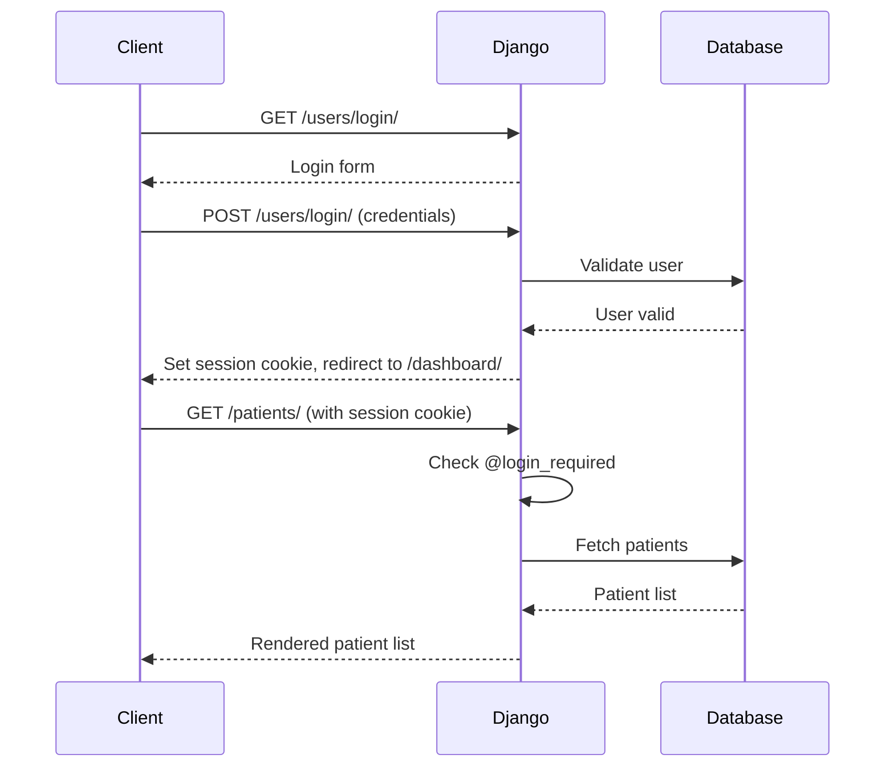

## Overview

DataMed uses Django's built-in session-based authentication. All API endpoints require users to be logged in, enforced by the `@login_required` decorator.

## Configuration

Authentication settings from `config/settings.py:172-174`:

```python
LOGIN_URL = 'login'
LOGIN_REDIRECT_URL = 'dashboard'
LOGOUT_REDIRECT_URL = 'login'
```

## Authentication Flow

### 1. Login

Users must authenticate through the `/users/` endpoints (handled by the users app).

<Note>
  The root URL `/` automatically redirects to the login page for unauthenticated users.
</Note>

### 2. Session Cookie

After successful login, Django creates a session cookie that must be included in all subsequent requests.

### 3. Access Protected Endpoints

All patient and exam endpoints check authentication:

```python
@login_required
def patients_list(request):
    # View implementation
```

### 4. Logout

Logging out destroys the session and redirects to the login page.

## Protected Endpoints

All endpoints in the following modules require authentication:

- `/patients/*` - All patient management endpoints
- `/exams/*` - All clinical examination endpoints
- `/dashboard/*` - Dashboard views

## Request Requirements

### Including Session Cookie

When making requests to protected endpoints, include the session cookie:

```bash
curl -X GET https://your-domain.com/patients/ \
  -H "Cookie: sessionid=your-session-id" \
  -H "X-CSRFToken: your-csrf-token"
```

### CSRF Protection

Django's CSRF protection is enabled. For `POST`, `PUT`, `PATCH`, and `DELETE` requests:

1. Include the CSRF token in the request header
2. Or include it in the form data as `csrfmiddlewaretoken`

<CodeGroup>
```bash Header Method
curl -X POST https://your-domain.com/patients/create/ \
  -H "Cookie: sessionid=your-session-id" \
  -H "X-CSRFToken: your-csrf-token" \
  -d "nombre=Juan&apellido=Perez&..."
```

```bash Form Method
curl -X POST https://your-domain.com/patients/create/ \
  -H "Cookie: sessionid=your-session-id" \
  -d "csrfmiddlewaretoken=your-csrf-token&nombre=Juan&apellido=Perez&..."
```
</CodeGroup>

## User Context

Authenticated users are available in views via `request.user`. This is used to track who registered clinical data:

```python
monitoreo.registrado_por = request.user
monitoreo.save()
```

## Access Control

Currently, DataMed uses authentication without granular authorization. All authenticated users have access to all endpoints.

<Warning>
  There is no role-based access control (RBAC) implemented. All authenticated users can access and modify all patient data.
</Warning>

## Unauthorized Access

If a user attempts to access a protected endpoint without authentication:

1. Django redirects to `LOGIN_URL` (`/users/login/`)
2. After successful login, redirects to `LOGIN_REDIRECT_URL` (`/dashboard/`)

## Security Considerations

### Production Settings

From `config/settings.py:34-48`:

```python
SECRET_KEY = os.environ.get('SECRET_KEY', 'django-insecure-local-dev-key')
DEBUG = 'RENDER' not in os.environ

ALLOWED_HOSTS = [
    'datamed-k68i.onrender.com',
    'www.datamed-k68i.onrender.com',
    'localhost',
    '127.0.0.1',
]

CSRF_TRUSTED_ORIGINS = [
    'https://datamed-k68i.onrender.com',
    "https://www.datamed-k68i.onrender.com"
]
```

### HTTPS Requirements

In production (Render deployment):
- All requests should use HTTPS
- Session cookies are marked secure
- CSRF tokens validate origin

## Example: Complete Request Flow



## Testing Authentication

For development and testing:

```python
# In Django shell
from django.test import Client

client = Client()
# Login
client.login(username='testuser', password='password')

# Make authenticated request
response = client.get('/patients/')
print(response.status_code)  # 200

# Logout
client.logout()
```