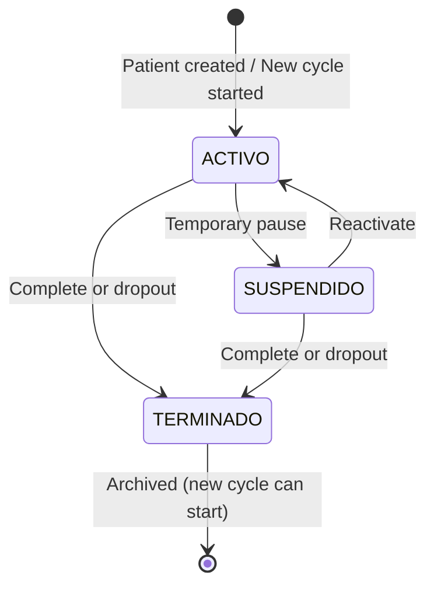

## Overview

The Ingresos (Program Entries) API manages patient enrollment cycles in the sleep apnea program. Each Ingreso represents a 18-month program cycle with status tracking and lifecycle management.

<Note>
  Ingreso endpoints are part of the Patients API module but warrant separate documentation due to their critical role in organizing clinical data.
</Note>

## Concepts

### Ingreso Model

From `apps/patients/models.py:153`:

An Ingreso represents a program enrollment cycle with:

- **Duration:** 18 months maximum
- **Status:** ACTIVO, SUSPENDIDO, or TERMINADO
- **Scope:** Organizes all clinical exam data
- **Calculation:** Automatic mes_capita (month in program)

### Mes Capita (Program Month)

From `apps/patients/models.py:167-178`:

```python
@property
def mes_capita(self):
    """Calcula el mes actual del programa (1 al 18)"""
    if not self.fecha_inicio:
        return 0
    
    hoy = date.today()
    meses = (hoy.year - self.fecha_inicio.year) * 12 + (hoy.month - self.fecha_inicio.month) + 1
    
    if meses < 1: return 1
    if meses > 18: return 18
    return meses
```

Automatically calculated property showing current month in program (1-18).

### Patient-Ingreso Relationship

- One patient can have multiple Ingresos (sequential program cycles)
- Only one Ingreso can be ACTIVO at a time per patient
- All clinical exams link to a specific Ingreso
- When starting a new cycle, previous exam data is archived

## Endpoints

### Change Ingreso Status

```http
POST /patients/ingreso/estado/<int:entry_id>/<str:new_status>/
```

Change the status of a program entry. Requires additional data when terminating.

**View Function:** `change_status_entry` in `apps/patients/views.py:169`

#### URL Parameters

<ParamField path="entry_id" type="integer" required>
  Ingreso's unique identifier
</ParamField>

<ParamField path="new_status" type="string" required>
  New status value. Options: `ACTIVO`, `SUSPENDIDO`, `TERMINADO`
</ParamField>

#### POST Parameters (for TERMINADO status)

<ParamField body="fecha_terminacion" type="date" required>
  Program end date in YYYY-MM-DD format. Required when new_status is TERMINADO.
</ParamField>

<ParamField body="motivo_estado" type="text" required>
  Reason for termination. Required when new_status is TERMINADO.
</ParamField>

#### Implementation

From `apps/patients/views.py:179-186`:

```python
if request.method == 'POST' and new_status == 'TERMINADO':
    ingreso.fecha_fin = request.POST.get('fecha_terminacion')
    ingreso.motivo = request.POST.get('motivo_estado')
    ingreso.estado = 'TERMINADO'
    ingreso.save()
    
    messages.success(request, f"Ciclo de {ingreso.paciente.nombre} finalizado y archivado ✅")
```

#### Response

**Success (302):** Redirects to `/patients/follow` with success message

#### Status Transition Rules

<ResponseField name="ACTIVO" type="status">
  Active program entry. Patient can have exams registered. Only one per patient.
</ResponseField>

<ResponseField name="SUSPENDIDO" type="status">
  Suspended entry. Temporary pause in program. Can be reactivated.
</ResponseField>

<ResponseField name="TERMINADO" type="status">
  Terminated entry. Requires fecha_fin and motivo. Cannot be reactivated. Exam data is archived.
</ResponseField>

<Warning>
  Setting status to TERMINADO requires both fecha_terminacion and motivo_estado. The request will update the record but may not validate these requirements in the view logic.
</Warning>

---

### Create New Entry (Ingreso)

```http
POST /patients/ingreso/nuevo/<int:patient_id>/
```

Create a new program entry (cycle) for an existing patient. Validates no active/suspended entries exist.

**View Function:** `create_new_entry` in `apps/patients/views.py:193`

#### URL Parameters

<ParamField path="patient_id" type="integer" required>
  Patient's unique identifier
</ParamField>

#### POST Parameters

<ParamField body="fecha_inicio" type="date" required>
  Program start date in YYYY-MM-DD format.
</ParamField>

#### Validation Logic

From `apps/patients/views.py:208-214`:

```python
tiene_ciclo_abierto = patient.ingresos.filter(estado__in=['ACTIVO', 'SUSPENDIDO']).exists()

if tiene_ciclo_abierto:
    messages.error(request, "No se puede iniciar nuevo ciclo: El paciente tiene un proceso pendiente.")
else:
    Ingreso.objects.create(
        paciente=patient,
        fecha_inicio=fecha,
        estado='ACTIVO'
    )
```

<Note>
  You cannot create a new Ingreso if the patient has any ACTIVO or SUSPENDIDO entries. All previous entries must be TERMINADO first.
</Note>

#### Response

**Success (302):** Redirects to `/patients/follow` with success message

**Validation Error (302):** Redirects to `/patients/follow` with error message

#### Automatic Ingreso Creation

Note that when creating a new patient via `/patients/create/`, an Ingreso is automatically created:

From `apps/patients/views.py:80-84`:

```python
Ingreso.objects.create(
    paciente=patient,
    fecha_inicio=fecha_ingreso,
    estado='ACTIVO'
)
```

You only need to use the create_new_entry endpoint for subsequent program cycles.

---

## Ingreso Model Structure

From `apps/patients/models.py:153`:

### Fields

<ResponseField name="id" type="integer">
  Auto-incrementing primary key
</ResponseField>

<ResponseField name="paciente" type="ForeignKey">
  Links to Patient model. Related name: `ingresos`
</ResponseField>

<ResponseField name="fecha_inicio" type="date" required>
  Program start date
</ResponseField>

<ResponseField name="fecha_fin" type="date">
  Program end date. Null until status changes to TERMINADO.
</ResponseField>

<ResponseField name="estado" type="string" default="ACTIVO">
  Current status. Choices: ACTIVO, SUSPENDIDO, TERMINADO
</ResponseField>

<ResponseField name="motivo" type="text">
  Reason for status change (especially for TERMINADO). Optional.
</ResponseField>

### Computed Property

<ResponseField name="mes_capita" type="integer">
  Calculated month in program (1-18). Read-only property based on fecha_inicio and current date.
</ResponseField>

### Related Names

Access from Patient object:

```python
patient.ingresos.all()                          # All entries
patient.ingresos.filter(estado='ACTIVO')        # Active entry
patient.ingreso_activo                          # Property: active entry or None
patient.esta_activo                             # Property: boolean, has active entry
```

## Ingreso Lifecycle



### Lifecycle Rules

1. **Initial Creation**
   - New patients get automatic ACTIVO Ingreso
   - fecha_inicio defaults to current date or specified date
   - mes_capita starts at 1

2. **Active State (ACTIVO)**
   - Only one ACTIVO Ingreso per patient
   - All new exam data links to this Ingreso
   - mes_capita increments monthly (1-18)
   - Can transition to SUSPENDIDO or TERMINADO

3. **Suspended State (SUSPENDIDO)**
   - Temporary program pause
   - Blocks new Ingreso creation
   - Can reactivate to ACTIVO
   - Can terminate to TERMINADO

4. **Terminated State (TERMINADO)**
   - Requires fecha_fin and motivo
   - Cannot be changed back
   - Exam data is archived (not shown in clinical view)
   - Allows new Ingreso creation

## Impact on Clinical Data

### Exam Filtering

All exam views filter by active Ingreso:

From `apps/exams/views.py:23-36`:

```python
ingreso_actual = patient.ingresos.filter(estado='ACTIVO').first()

if ingreso_actual:
    monitoreos = Monitoreo.objects.filter(ingreso=ingreso_actual).order_by('-id')
    sesiones_psicologia = Psicologia.objects.filter(ingreso=ingreso_actual).order_by('-id')
    # ... other exams
```

### Data Isolation

<Note>
  When a patient starts a new program cycle (new Ingreso), all previous exam data is automatically hidden. The clinical history view only displays exams linked to the current ACTIVO Ingreso.
</Note>

This ensures:
- Clean slate for new program cycles
- Historical data preservation
- No confusion between old and new treatment data

### Historical Access

To access archived exam data from previous cycles:

```python
# Get all ingresos for a patient
all_ingresos = patient.ingresos.all()

# Get exams from specific ingreso
old_ingreso = patient.ingresos.get(id=previous_ingreso_id)
old_monitoreos = Monitoreo.objects.filter(ingreso=old_ingreso)
```

## Integration Examples

### Check if Patient Can Start New Cycle

```python
patient = Patient.objects.get(id=patient_id)

# Check for open cycles
has_open_cycle = patient.ingresos.filter(
    estado__in=['ACTIVO', 'SUSPENDIDO']
).exists()

if not has_open_cycle:
    # Can create new Ingreso
    new_ingreso = Ingreso.objects.create(
        paciente=patient,
        fecha_inicio=date.today(),
        estado='ACTIVO'
    )
```

### Get Current Program Month

```python
patient = Patient.objects.get(id=patient_id)
ingreso_actual = patient.ingreso_activo

if ingreso_actual:
    current_month = ingreso_actual.mes_capita  # 1-18
    print(f"Patient is in month {current_month} of 18")
```

### Terminate Program Entry

```python
from django.utils import timezone

ingreso = Ingreso.objects.get(id=entry_id)
ingreso.estado = 'TERMINADO'
ingreso.fecha_fin = timezone.now().date()
ingreso.motivo = 'Programa completado exitosamente'
ingreso.save()

# Now patient can start new cycle
```

## Common Patterns

### Active Ingreso Check

Always check for active Ingreso before registering exams:

```python
ingreso_actual = patient.ingresos.filter(estado='ACTIVO').first()

if not ingreso_actual:
    messages.error(request, "Patient has no active program entry")
    return redirect('patients_list')

# Proceed with exam registration
exam.ingreso = ingreso_actual
exam.save()
```

### Patient Properties

Use Patient model properties for quick checks:

```python
if patient.esta_activo:
    # Patient has active program
    current_ingreso = patient.ingreso_activo
    
else:
    # Patient needs new Ingreso
    # Check if can create (no suspended entries)
```

## Best Practices

<Warning>
  **Critical:** Never create multiple ACTIVO Ingresos for the same patient. Always validate existing status before creating new entries.
</Warning>

1. **Status Transitions**
   - Always provide fecha_fin and motivo when terminating
   - Validate no ACTIVO/SUSPENDIDO entries before creating new
   - Use clear, descriptive motivo text for audit trail

2. **Data Integrity**
   - Check ingreso_actual exists before exam registration
   - Link all exams to appropriate Ingreso
   - Preserve registrado_por for audit trail

3. **User Experience**
   - Show mes_capita in patient lists and forms
   - Indicate when patient approaching month 18
   - Warn before terminating with active exams

4. **Clinical Workflows**
   - Complete all pending exams before terminating
   - Document termination reasons thoroughly
   - Allow time between termination and new cycle creation

## Related Endpoints

<CardGroup cols={2}>
  <Card title="Patients API" icon="user" href="/api/patients">
    Manage patient records that own Ingresos
  </Card>
  <Card title="Exams API" icon="stethoscope" href="/api/exams">
    Clinical data filtered by Ingreso
  </Card>
</CardGroup>