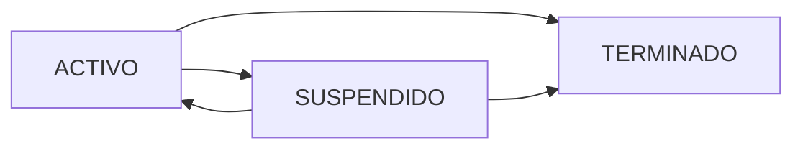

## Overview

In DataMed, a **cycle (Ingreso)** represents a patient's enrollment period in the sleep apnea program. Each cycle tracks the patient's progress through an 18-month treatment period, with automatic month calculation (mes_capita).

<Note>
  DataMed uses the term "Ingreso" (cycle/enrollment) to track distinct treatment periods. All clinical data is linked to a specific cycle, allowing historical tracking when patients re-enroll.
</Note>

## Cycle Lifecycle

A cycle progresses through three possible states:



<AccordionGroup>
  <Accordion title="ACTIVO (Active)">
    **Active State**
    - Patient is currently enrolled in the program
    - Clinical data can be recorded
    - Monthly billing (capitación) is calculated
    - Only ONE active cycle allowed per patient
    - Created automatically when registering a new patient
  </Accordion>
  
  <Accordion title="SUSPENDIDO (Suspended)">
    **Suspended State**
    - Temporary program pause
    - Clinical data recording disabled
    - Can be reactivated to ACTIVO
    - Can be finalized to TERMINADO
  </Accordion>
  
  <Accordion title="TERMINADO (Finished)">
    **Finished State**
    - Cycle is permanently closed
    - Requires end date and reason
    - Cannot be reopened
    - Historical data preserved
    - Allows creation of new cycle
  </Accordion>
</AccordionGroup>

## Cycle Month Calculation

DataMed automatically calculates which month (1-18) a patient is in:

```python
# From apps/patients/models.py:166
@property
def mes_capita(self):
    """Calcula el mes actual del programa (1 al 18)"""
    if not self.fecha_inicio:
        return 0
    
    hoy = date.today()
    # Calculate months elapsed
    meses = (hoy.year - self.fecha_inicio.year) * 12 + \
            (hoy.month - self.fecha_inicio.month) + 1
    
    if meses < 1: return 1
    if meses > 18: return 18
    return meses
```

<Warning>
  The `mes_capita` is a computed property, not a database field. It's calculated in real-time based on the `fecha_inicio` date.
</Warning>

## Accessing Cycle Management

<Steps>
  <Step title="Navigate to Follow-ups Manager">
    Go to `/patients/follow` to access the cycle management interface
  </Step>
  
  <Step title="Search for Patient">
    Use the search bar to find patients by name, apellido, or document number
  </Step>
  
  <Step title="View Patient Cycles">
    All cycles (ingresos) for each patient are displayed with their current status
  </Step>
</Steps>

## Changing Cycle Status

### Terminating a Cycle (ACTIVO → TERMINADO)

When finalizing a cycle, you must provide additional information:

<Steps>
  <Step title="Select Terminate Action">
    Click the terminate button for the cycle you want to close
  </Step>
  
  <Step title="Fill Required Fields">
    A form will appear requiring:
    
    ```python
    # Required fields for termination
    fecha_terminacion = forms.DateField()  # End date
    motivo_estado = forms.TextField()  # Reason for termination
    ```
  </Step>
  
  <Step title="Submit">
    The cycle status changes to TERMINADO and is archived
  </Step>
</Steps>

**Implementation details** (see `apps/patients/views.py:change_status_entry`, line 169):

```python
def change_status_entry(request, entry_id, new_status):
    ingreso = get_object_or_404(Ingreso, id=entry_id)
    
    if request.method == 'POST' and new_status == 'TERMINADO':
        # Capture required closure data
        ingreso.fecha_fin = request.POST.get('fecha_terminacion')
        ingreso.motivo = request.POST.get('motivo_estado')
        ingreso.estado = 'TERMINADO'
        ingreso.save()
        
        messages.success(request, 
            f"Ciclo de {ingreso.paciente.nombre} finalizado y archivado ✅")
    
    return redirect('patients_follow')
```

### Suspending a Cycle (ACTIVO → SUSPENDIDO)

<Warning>
  Suspended cycles do not require an end date or reason, but they prevent new clinical data entry.
</Warning>

**URL Pattern**: `/patients/ingreso/estado/<entry_id>/SUSPENDIDO/`

### Reactivating a Cycle (SUSPENDIDO → ACTIVO)

<Note>
  You can reactivate a suspended cycle as long as no other cycle is currently ACTIVO for that patient.
</Note>

**URL Pattern**: `/patients/ingreso/estado/<entry_id>/ACTIVO/`

## Creating a New Cycle

Patients can have multiple cycles over time, but only one can be ACTIVO at a time.

### When to Create a New Cycle

- Patient completes 18-month program and re-enrolls
- Patient returns after termination for a new treatment period
- Program change requires new cycle tracking

### Creation Process

<Steps>
  <Step title="Verify No Active Cycles">
    The system checks for existing ACTIVO or SUSPENDIDO cycles:
    
    ```python
    tiene_ciclo_abierto = patient.ingresos.filter(
        estado__in=['ACTIVO', 'SUSPENDIDO']
    ).exists()
    ```
  </Step>
  
  <Step title="Access New Cycle Form">
    Navigate to `/patients/ingreso/nuevo/<patient_id>/`
  </Step>
  
  <Step title="Set Start Date">
    Provide the new cycle start date in the modal form
  </Step>
  
  <Step title="Submit">
    A new ACTIVO cycle is created:
    
    ```python
    Ingreso.objects.create(
        paciente=patient,
        fecha_inicio=fecha,
        estado='ACTIVO'
    )
    ```
  </Step>
</Steps>

**Implementation** (see `apps/patients/views.py:create_new_entry`, line 193):

```python
def create_new_entry(request, patient_id):
    patient = get_object_or_404(Patient, id=patient_id)
    
    if request.method == 'POST':
        fecha = request.POST.get('fecha_inicio')
        
        # SECURITY: Check for open cycles before creating
        tiene_ciclo_abierto = patient.ingresos.filter(
            estado__in=['ACTIVO', 'SUSPENDIDO']
        ).exists()
        
        if tiene_ciclo_abierto:
            messages.error(request, 
                "No se puede iniciar nuevo ciclo: El paciente tiene un proceso pendiente.")
        else:
            # CREATE NEW CYCLE
            Ingreso.objects.create(
                paciente=patient,
                fecha_inicio=fecha,
                estado='ACTIVO'
            )
            messages.success(request, 
                f"¡Nuevo ciclo iniciado para {patient.nombre}!")
            
    return redirect('patients_follow')
```

<Warning>
  **Critical Validation**: You cannot create a new cycle while the patient has an ACTIVO or SUSPENDIDO cycle. The previous cycle must be TERMINADO first.
</Warning>

## Data Isolation Between Cycles

When a new cycle is created, clinical data is properly isolated:

### How It Works

1. **Old Cycle**: All exams remain linked to the TERMINADO cycle
2. **New Cycle**: Clinical history view shows only ACTIVO cycle data
3. **Historical Access**: Previous cycle data is preserved but not displayed in current workflows

```python
# From apps/exams/views.py:patient_clinical (line 23)
ingreso_actual = patient.ingresos.filter(estado='ACTIVO').first()

if ingreso_actual:
    # Only show exams from the ACTIVE cycle
    monitoreos = Monitoreo.objects.filter(ingreso=ingreso_actual)
    sesiones_psicologia = Psicologia.objects.filter(ingreso=ingreso_actual)
    # ... etc
else:
    # No active cycle = empty lists
    monitoreos = sesiones_psicologia = []
```

<Tip>
  This design prevents confusion when a patient starts "Month 1" again in a new cycle—previous exam data won't interfere with the new treatment period.
</Tip>

## Filtering Patients by Cycle Month

In the patient list view, you can filter by mes_capita:

```python
# From apps/patients/views.py:38
mes_filtro = request.GET.get('mes_filtro', '')

if mes_filtro:
    filtered_patients = []
    for p in patients:
        ingreso = p.ingreso_activo 
        if ingreso and str(ingreso.mes_capita) == str(mes_filtro):
            filtered_patients.append(p)
    patients = filtered_patients
```

<Note>
  Because `mes_capita` is a property (not a database field), filtering requires iteration rather than database queries.
</Note>

## Patient Properties for Cycle Status

The Patient model provides convenient properties:

```python
# From apps/patients/models.py:128
@property
def ingreso_activo(self):
    # Get the ACTIVE cycle
    return self.ingresos.filter(estado='ACTIVO').first()

@property
def esta_activo(self):
    # Check if patient has any active cycle
    return self.ingresos.filter(estado='ACTIVO').exists()
```

## Common Scenarios

<AccordionGroup>
  <Accordion title="Patient Completes 18-Month Program">
    **Scenario**: Patient reaches month 18 and completes treatment successfully
    
    **Steps**:
    1. Change cycle status to TERMINADO
    2. Enter completion date and reason (e.g., "Programa completado exitosamente")
    3. Cycle is archived with all clinical data preserved
    4. If patient re-enrolls later, create a new cycle
  </Accordion>
  
  <Accordion title="Patient Temporarily Leaves Program">
    **Scenario**: Patient needs to pause treatment temporarily
    
    **Steps**:
    1. Change cycle status to SUSPENDIDO
    2. When patient returns, reactivate to ACTIVO
    3. Month calculation continues from original start date
    4. If patient won't return, finalize to TERMINADO
  </Accordion>
  
  <Accordion title="Patient Drops Out">
    **Scenario**: Patient discontinues treatment before completion
    
    **Steps**:
    1. Change cycle status to TERMINADO
    2. Enter discontinuation date
    3. Enter reason (e.g., "Abandono del programa", "Traslado a otra ciudad")
    4. Cycle is permanently closed
  </Accordion>
  
  <Accordion title="Program Change Required">
    **Scenario**: Patient needs to switch from AOS program to another program
    
    **Steps**:
    1. Terminate current cycle with appropriate reason
    2. Update patient record (programa field)
    3. Create new cycle with new start date
    4. New cycle begins at Month 1
  </Accordion>
</AccordionGroup>

## Billing Implications

The `mes_capita` property is used for billing calculations:

```python
# Patient model (line 126)
valor_capita = models.DecimalField(
    max_digits=10,
    decimal_places=2,
    default=259783
)
```

<Warning>
  Only patients with ACTIVO status should be included in monthly billing reports. Filter by `estado='ACTIVO'` when generating capitación lists.
</Warning>

## URL Reference

- **Cycle Management**: `/patients/follow`
- **Change Status**: `/patients/ingreso/estado/<entry_id>/<new_status>/`
- **Create New Cycle**: `/patients/ingreso/nuevo/<patient_id>/`

## Technical Schema

```python
class Ingreso(models.Model):
    ESTADO_CHOICES = [
        ('ACTIVO', 'Activo'),
        ('SUSPENDIDO', 'Suspendido'),
        ('TERMINADO', 'Terminado')
    ]

    paciente = models.ForeignKey(
        'Patient', 
        on_delete=models.CASCADE, 
        related_name='ingresos'
    )
    fecha_inicio = models.DateField()
    fecha_fin = models.DateField(null=True, blank=True)
    estado = models.CharField(
        max_length=20, 
        choices=ESTADO_CHOICES, 
        default='ACTIVO'
    )
    motivo = models.TextField(blank=True, null=True)
```

## Best Practices

<CardGroup cols={2}>
  <Card title="Document Everything" icon="file-lines">
    Always provide clear, detailed reasons when terminating cycles
  </Card>
  
  <Card title="Regular Reviews" icon="calendar-check">
    Periodically review suspended cycles to finalize or reactivate
  </Card>
  
  <Card title="Accurate Dates" icon="calendar-day">
    Use actual dates for cycle transitions, not future dates
  </Card>
  
  <Card title="One Active Rule" icon="circle-exclamation">
    Ensure only ONE active cycle per patient at all times
  </Card>
</CardGroup>

## Next Steps

<CardGroup cols={2}>
  <Card title="Record Exams" icon="file-medical" href="/guides/recording-exams">
    Learn how to record clinical data for active cycles
  </Card>
  
  <Card title="Export Data" icon="download" href="/guides/data-export">
    Generate reports including cycle information
  </Card>
</CardGroup>